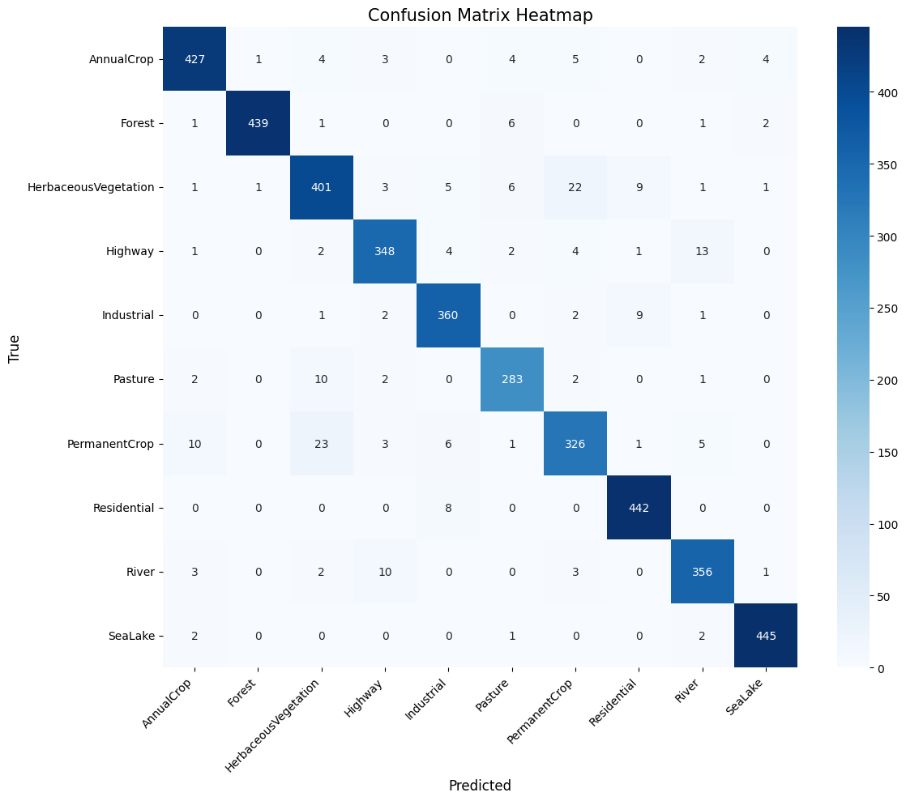
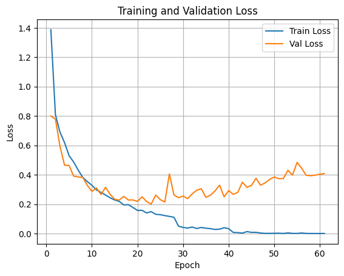

# 🌍 EuroSat Land Use Classification with Deep Learning


A comprehensive Deep Learning project for classifying satellite images into 10 different land-use categories. This repository explores custom CNN architectures, state-of-the-art models (Inception, ResNet, SE-ResNet, SqueezeNet), hyperparameter tuning, and cross-framework model deployment using ONNX.

---

## 📖 Table of Contents
- [Project Overview](#-project-overview)
- [Dataset](#-dataset)
- [Preprocessing & Pipeline](#-preprocessing--pipeline)
- [Model Architectures](#-model-architectures)
- [Results & Evaluation](#-results--evaluation)
- [Model Deployment (ONNX)](#-model-deployment-onnx)
- [Repository Structure](#-repository-structure)
- [How to Run](#-how-to-run)

---

## 🔍 Project Overview
The goal of this project is to accurately classify satellite images from the **EuroSat** dataset. By designing from-scratch Baseline CNNs, tuning their hyperparameters, and implementing modern architectures like **Inception**, **ResNet**, **SE-ResNet**, and **SqueezeNet**, this project demonstrates a deep understanding of CNN design patterns. The final, most optimized model is then exported and evaluated in a different deep learning framework (PyTorch) using **ONNX** to simulate a real-world production deployment.

---

## 🛰️ Dataset
We use the **[EuroSAT Dataset](https://www.kaggle.com/datasets/apollo2506/eurosat-dataset)** (downloaded via Kaggle), which contains:
- **Total Images:** 27,000
- **Format:** RGB Images, $64 \times 64$ pixels
- **Classes:** 10 distinct land-use categories (e.g., Forest, Highway, Residential, etc.)

**Data Split (Stratified to maintain class balance):**
- **Training Set:** 70% (18,900 images)
- **Validation Set:** 15% (4,050 images)
- **Test Set:** 15% (4,050 images)

---

## ⚙️ Preprocessing & Pipeline
To ensure robust training and prevent data-loading bottlenecks:
- **Normalization:** Pixel values scaled by $1/255$ to the $[0, 1]$ range.
- **Randomization:** Images were shuffled randomly to eliminate biases.
- **Data Pipeline:** Utilized `tf.data.Dataset` with `.prefetch()` to optimize GPU utilization during training.

---

## 🧠 Model Architectures
Several architectures were implemented and compared:

1. **Baseline CNN:** Custom 3-layer Convolutional network (32, 64, 128 filters) with $3 \times 3$ kernels, MaxPooling, BatchNorm, Dropout (0.25), L2 Regularization ($1e-4$), and He Initialization.
2. **Tuned CNN:** Extensively tuned using different hyperparameter combinations (via Keras Tuner) to find the optimal setup.
3. **Inception-Based Model:** Custom implementation featuring a Stem, Inception-A/C blocks, and Reduction-A block.
4. **ResNet:** Residual architecture utilizing skip connections to improve gradient flow.
5. **SE-ResNet:** Incorporation of Squeeze-and-Excitation blocks within a Residual network to adaptively recalibrate channel-wise feature responses.
6. **SqueezeNet:** A lightweight architecture utilizing fire modules, designed to minimize parameters.

---

## 📊 Results & Evaluation

Despite SqueezeNet having around 700,000 parameters, the **Inception-based architecture** proved to be the most efficient and accurate, achieving the best performance with only **~300,000 parameters**. This highlights that architectural design and feature extraction mechanisms are often more crucial than sheer parameter count.

### 🏆 Model Comparison

| Model | Test Accuracy | Notes |
|-------|---------------|-------|
| **Baseline CNN** | 94.02% | Custom built from scratch |
| **Tuned CNN** | 94.30% | Optimized via Keras Tuner |
| **⭐ Inception-based**| **94.69%** | **Best Performing Model** |
| **ResNet** | 94.37% | - |
| **SE-ResNet** | 93.56% | - |
| **SqueezeNet** | 87.98% | Lightweight architecture approach |

### 📈 Training Curves & Confusion Matrices
*(Replace the placeholder links below with your actual image paths once you push to GitHub)*

**Inception Model - Confusion Matrix:**
<p align="center">
  
</p>

**Inception Model - Accuracy & Loss:**
<p align="center">
  
</p>

*The diagonal dominance in our confusion matrices indicates strong class separation with very minimal inter-class confusion.*

---

## 🚀 Model Deployment (ONNX)
To demonstrate production-readiness, the best model (**Inception-based**) was exported to the **ONNX** format.
- **Trained in:** TensorFlow / Keras
- **Exported to:** `.onnx`
- **Inference in:** PyTorch
- **Deployment Test Accuracy:** **94.05%**

This proves the model's portability across different Deep Learning frameworks without losing performance.

---

## 📁 Repository Structure
```text
📦 EuroSat-Classification
 ┣ 📂 data/               # Instructions/scripts for downloading the dataset
 ┣ 📂 notebooks/          # Jupyter notebooks for training and EDA
 ┣ 📂 src/                # Python scripts (architectures, utils, train, eval)
 ┣ 📂 images/             # Plots, Confusion Matrices, and diagram images
 ┣ 📜 requirements.txt    # Dependencies
 ┗ 📜 README.md           # Project documentation

---
